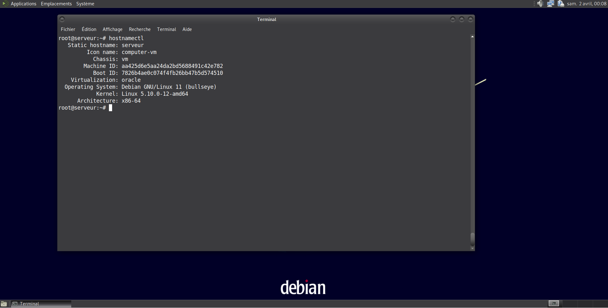
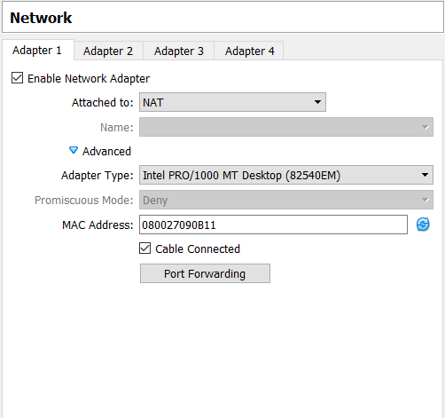
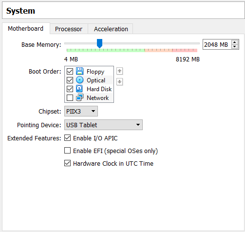
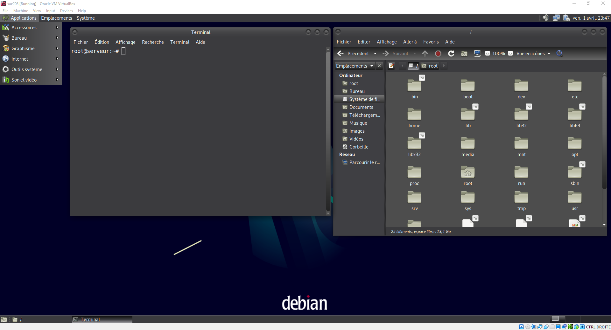

# <u>Rendu 1 : Préparation d'une machine virtuelle Debian</u>

## A. Notre avancement dans l'installation

Nous n'avons pas rencontré de difficultés particulières lors de l'installation de la machine virtuelle. Nous l'avons chacun installé de notre côté pour pouvoir réaliser chaque tâche et comprendre les mécanismes de la machine virtuelle, tout en nous mettant d'accord lorsqu'il y a des choix techniques à réaliser.

  
*Spécificité d'une des machines et l'environnement de bureau MATE installé*

## B. Réponses aux questions

### <u>Q1: Quelle est la configuration réseau utilisée par défaut ?</u>

La configuration réseau par défaut de la machine invitée est NAT, ou Network Address Translation. C'est la configuration la plus simple pour que l'invité puisse accéder aux réseaux externes. La machine virtuelle peut communiquer avec Internet ou d'autres réseaux à travers un router, qui est dans ce cas le "VM VirtualBox networking engine" placé entre l'invité et l'hôte.  

Le VM VirtualBox NAT engine reçoit les paquets de la machine invitée, extrait les données de la trame TCP/IP, et l'envoie au système hôte. Pour les autres machines, c'est comme si les données avaient été envoyées de l'application "VM VirtualBox" de la machine hôte avec l'adresse IP de la machine hôte, et non pas de la machine invitée comme c'est le cas. L'engine écoute les réponses aux paquets envoyés, extrait les données et les renvoie vers la machine invitée.  

  
*Exemple : configuration de notre machine depuis VM VirtualBox*

> Référence : <https://www.virtualbox.org/manual/ch06.html>

### <ins>Q2: Quel est le nom du fichier XML contenant la configuration de votre machine ?</ins>

Le fichier XML qui contient la configuration de la machine se nomme `sae203.vbox-pre`  
Il a un emplacement différent selon le système d'exploitation de la machine hôte, sur Windows dans `$HOME\VirtualBox VMs\sae203\sae203.vbox-prev`  
Par ailleurs, on peut trouver le fichier de configuration globale de VM VirtualBox dans `$HOME\.VirtualBox\VirtualBox.xml` (sur Windows encore une fois)

> Référence : <https://docs.oracle.com/en/virtualization/virtualbox/6.0/admin/vboxconfigdata.html>  
<https://www.virtualbox.org/manual/ch08.html#vboxmanage-guestproperty>

### <ins>Q3: Qu’est-ce que la RAM ?</ins>

La RAM (de l'anglais 'random access memory', souvent traduit en français par 'mémoire vive') est un espace de stockage de données temporaire et rapide. L'ordinateur stocke dans la RAM les données auxquelles il devra avoir accès immédiatement ou très rapidement, à l'inverse d'un disque dur qui stocke les données plus lentement mais plus durablement.

  
*Exemple : RAM alouée à notre machine depuis VM VirtualBox*

### <ins>Q4: Qu’est-ce que signifie “64-bits” dans “Debian 64-bit” ?</ins>

64 bits correspond à la taille des mots binaires manipulés par le processeur.  
Là où un système 32 bits ne peut adresser au maximum une mémoire d'uniquement 232 (=4Gio, ~4Go), le système 64 bits peut adresser des mémoires jusqu'à 264 (=16Eio*, =Enormément de mémoire ~1.84x1010).  
En pratique il permet donc d'utiliser plus de 4Go de RAM (~3.5Go en pratique) pour sa machine.  

*Eio = Exbioctet = 260 octets

### <ins>Q5: Qu’est-ce qu’un fichier iso bootable ?</ins>

Un fichier iso est une représentation, l'image d'un disque à l'identique.
Ce format est très utilisé pour partager des fichiers d'installation, en particulier ceux de systèmes d'exploitation car il permet de rassembler tous les fichiers, en conservant leur ordre d'origine, dans un seul et même fichier.
Un ISO est une archive, il est donc moins lourd que l'ensemble des fichiers originals.

Bootable veut dire que l'ordinateur pourra démarrer à partir de cette image ISO, "gravée" sur un support (CD, USB, DD) lui même inséré dans la machine.

### <ins>Q6: Qu’est-ce que MATE ? GNOME ?</ins>

MATE et GNOME (acronyme de 'GNU Network Object Model Environment') sont des environnements de bureau. Ils permettent d'utiliser un ordinateur grâce à une interface utilisateur graphique (GUI en anglais).  
Ce sont des ensembles de programmes qui aident l'utilisateur à accéder et gérer les fichiers, tout en faisant l'impasse sur certaines fonctionnalités plus spécifiques de l'ordinateur.  
Ces environnements de bureau sont souvent un ensemble d'icônes, de fenêtres, et souvent un bureau, qui permettent des interactions humain-machine.
L'utilisation d'environnement de bureau se fait au détriment des performances maximales de la machine, celle-ci utilisant des ressources pour l'affichage graphique.
Sans environnement de bureau, l'ordinateur ne serait utilisable qu'en lignes de commandes, et serait donc beaucoup moins accessible au grand public.

  
*Exemple : l'environnement de bureau MATE installé sur notre machine*

> Référence : <https://en.wikipedia.org/wiki/Desktop_environment>

### <ins>Q7: Qu’est-ce qu’un serveur web ?</ins>

C'est un serveur informatique qui répond à des requêtes du World Wide Web sur un réseau public ou privé, en utilisant principalement le protocole HTTP.  

Un serveur web est soit un logiciel (serveur HTTP pour les ressources web), soit un serveur informatique (ordinateur) qui répond à des requêtes de la toile.
Un serveur web utilise principalement le protocole HTTP (Hypertext Transfer Protocol) ou sa variante sécurisée HTTPS (HTTP Secure) pour répondre aux requêtes de clients. Ces requêtes varient et changent la nature des échanges entre le client et le serveur. Par exemple, la méthode GET permet au client de recevoir une ressource demandée, alors que la méthode POST va envoyer des données à une ressource du serveur qui devra les traiter. A chaque fois que le client reçoit une réponse du serveur, elle est accompagné d'un code qui indique comment s'est passé l'échange (par exemple, `200 OK` indique que tout s'est déroulé comme prévu, alors qu'un code de la forme `4XX` indique qu'une erreur est survenue. Parmis les plus connues, `404 Not Found` indique que la ressource n'a pas été trouvée, ou encore `418 I'm a teapot` indique que le serveur est une théière).

Un serveur web peut également gérer l'envoi et la réception d'emails grâce à différents protocoles : SMTP (Simple Mail Transfer Protocole) qui est le protocole utilisé pour envoyer les mails entre serveurs, et POP3 (Post Office Protocol) et IMAP (Internet Message Access Protocol) pour récuper les mails du serveur vers le client. POP3 transfert les mails du serveur au client, alors qu'IMAP les copie.

Enfin, un serveur web peut emettre des flux de diffusion, héberger une base de données ou encore assurer le transfert de fichiers (File Transfer Protocol, FTP).

> Références : [HTTP](https://datatracker.ietf.org/doc/html/rfc7231)  
[HTCPCP](https://datatracker.ietf.org/doc/html/rfc2324)  
[SMTP](https://datatracker.ietf.org/doc/html/rfc8314)  
[IMAP](https://datatracker.ietf.org/doc/html/rfc9051)  
[FTP](https://datatracker.ietf.org/doc/html/rfc959)

### <ins>Q8: Qu’est-ce qu’un serveur ssh ?</ins>

SSH (secure shell) est un protocole pour sécuriser la connexion entre deux ordinateurs à distance à travers un réseau non sécurisé en encryptant les communications.  
Le protocole SSH fonctionne sur un modèle client/serveur. Une machine (client) qui souhaite se connecter à une autre (hôte) va envoyer une requête qui va être traitée par le serveur SSH de cet hôte.  

Pour ce qui est du fonctionnement de ce protocole, il y a tout d'abord une phase de connexion : le serveur SSH va transmettre au client sa clé publique, preuve que le client communique avec la bonne machine (et non pas un possible pirate qui essayerais d'intercepter la communication).  
Si l'authentification réussie, la machine hôte va donner au client l'accès au système avec les permissions du compte avec lequel il s'est connectée.  
Cette connexion sécurisée peut être utilisée pour de l'administration, de l'exécution de commande, et des transferts de fichiers (SFTP, une version sécurisé du File Transfer Protocole) à distance, parmis beaucoup d'autres utilisations.

> Référence : <https://www.ssh.com/academy/ssh/protocol>

### <ins>Q9: Qu’est-ce qu’un proxy (ou serveur mandataire) ?</ins>

Un proxy (serveur mandataire) est quelque chose qui joue le rôle d'intermédiaire entre 2 hôtes pour faciliter et/ou surveiller les échanges.  
C'est un entremetteur qui relaie les requêtes entre deux fonctions, l'une cliente l'autre serveur.  

Un proxy est souvent utilisé comme interface entre un réseau privé et Internet (comme c'est le cas à l'université par exemple). Les machines du réseau privé communiquent d'abord avec le proxy qui va traiter l'information et l'envoyer vers le serveur pour lequel la requête était réellement destiné. Lorsque le proxy reçoit les potentielles réponses, il les renvoie vers la machine du réseau qui avait envoyé une requête. Il n'y a donc pas de communication directe entre le client et le seveur.  

Ainsi, toutes les communications du réseau passent par ce proxy, ce qui permet de sécuriser les communications, de filtrer des requêtes indésirables, de créer un historique des requêtes, parmis d'autres avantages plus techniques.  
De plus, l'accès à des ressources via un proxy permet de contourner certaines règles gouvernementales dans les pays où Internet est censuré, car le proxy fait la requête à la ressource demandée à la place de l'utilisateur.  
Enfin, il existe des proxys à utilisation plus spécifique, comme un proxy DNS qui fait le relais direct en transmettant les requêtes DNS vers un DNS, et peut aussi les mettre en mémoire cache pour les réutiliser.

> Référence : <https://en.wikipedia.org/wiki/Proxy_server>
