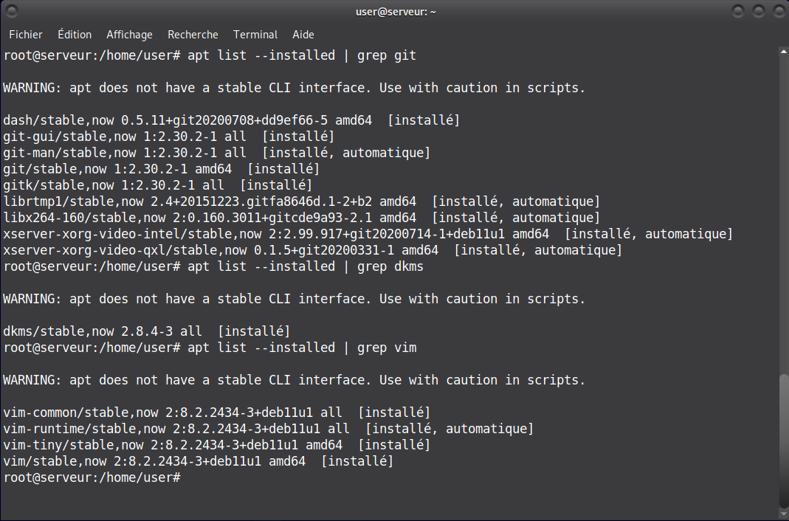
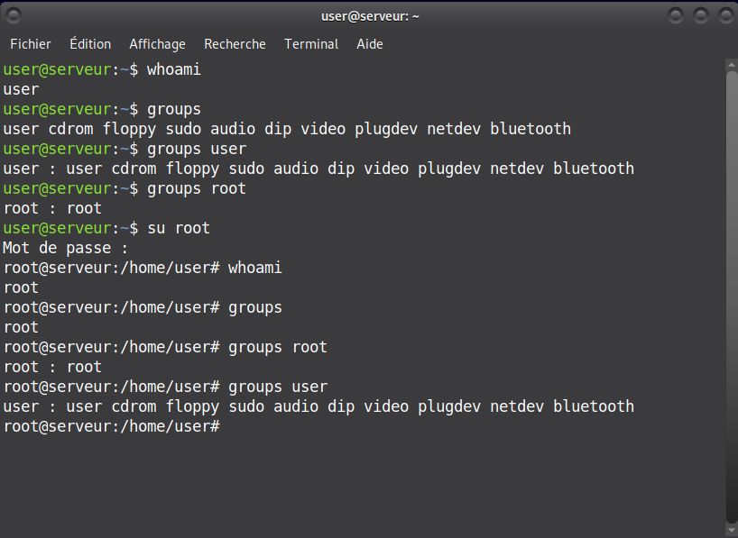
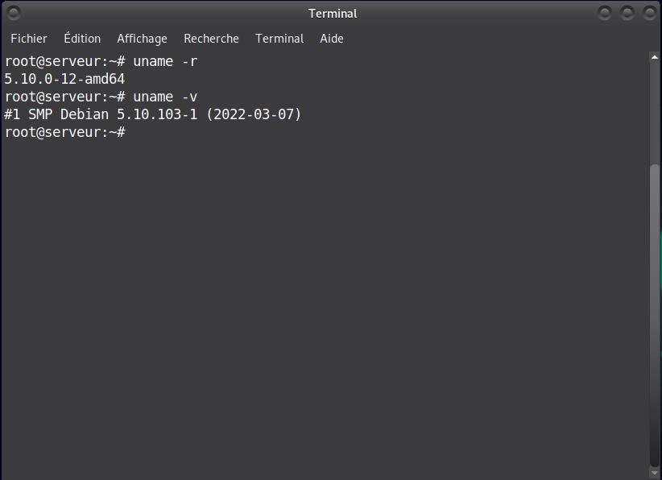
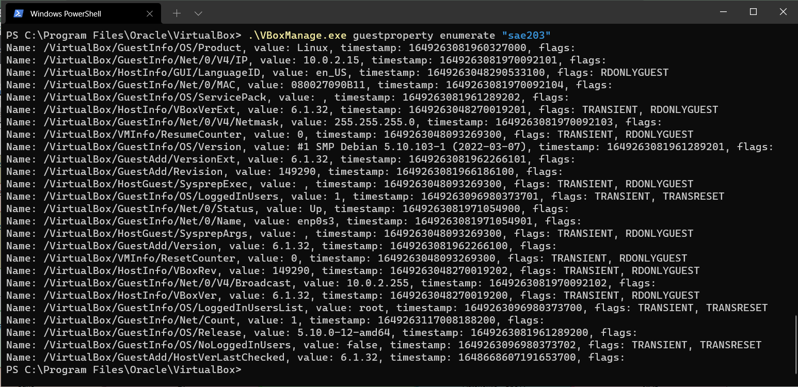
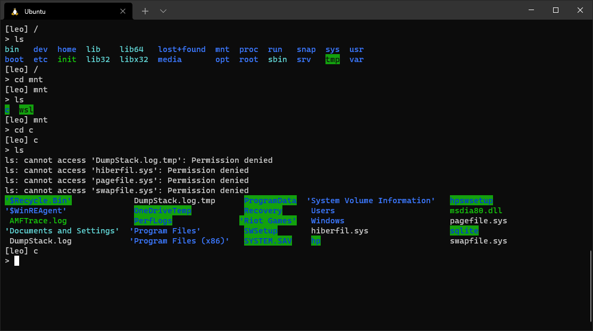

# <u>Rendu 2 : Préparation du système</u>

## A. Notre avancement dans l'installation

- Il n'y avait pas de décisions à prendre cette semaine pour le rendu, nous avons tous suivi les étapes de la préparation du système sur nos machines virtuelles en préparation des installations futures.
- Nous avons installé les différents paquets demandés dans l'énoncé, en plus de certains autres pour améliorer notre confort d'utilisation du système (comme pas exemple VSCodium).

    
  *Quelques paquets que nous avons installé (liste non exhaustive)*

- Nous avons bien installé les suppléments invités sur chacunes des machines en utilisant la commande `mount` sur le CDRom.
- Finalement, nous avons exporté notre machine virtuelle au format `.ova` pour pouvoir redémarrer une installation proprement au cas où un problème venait à survenir dans le futur.

## B. Réponses aux questions

### <u>Q1: Comment peux-t-on savoir à quels groupes appartient l'utilisateur *user* ?</u>

Pour savoir à quel(s) groupe(s) appartient un utilisateur, on peut utiliser la commande `groups` en ligne de commande.  
L'utilisation de la commande sans aucun argument affiche le(s) groupe(s) dans le quel l'utilisateur qui execute la commande se trouve.  

Pour connaître les groupes d'autres utilisateurs (par exemple, si on est connecté en tant que *root* et qu'on veut savoir à quels groupes appartient *user*, dans le cadre d'administration du système), il suffit d'ajouter le nom de l'utilisateur en argument, et tous les groupes de cet utilisateur seront affichés.

  
*Utilisation de `groups` connecté en tant que root*

> Référence : <https://www.man7.org/linux/man-pages/man1/groups.1.html> ou `man groups` en ligne de commande.

### <u>Q2: À quoi servent les paquets installés ?</u>

De nombreux paquets ont installés lors de cette étape. Voici un récapitulatif de ce qu'il font :

- `xterm` : émulateur de terminal.
- `vim` : "VI Improved", un éditeur de texte en ligne de commande.
- `curl` : outil qui permet de transferrer des données depuis ou vers un serveur en utilisant une URL, et qui supporte un grand nombre de protocoles.
- `git` : outil de gestion de versions décentralisés.
- `sqlite3` : gestion d'une base de donnée sqlite en ligne de commande.
- `build-essential` : ensemble de paquets qui sont nécessaires à la création de fichier .deb (Debian Linux Package File). Ces paquets sont :

  - `libc` : librairie standard C
  - `gcc` : collection de compilateurs de C et C++
  - `g++` : un compilateur de C
  - `make` : utilitaire pour compiler un fichier C et/ou un projet C en exécutable.
  - `dpkg-dev` et `hurd-dev`

  Exécuter la commande `sudo apt install build-essential` revient à installer tous ces paquets un à un (déconseillé car ces paquets ont des dépendances les uns envers les autres, il est donc conseillé de les installé dans le cadre de build-essential pour éviter des problèmes de dépendances).
- `dkms` : accronyme de 'Dynamic Kernel Module Support', c'est un environnement qui permet l'installation de versions supplémentaires des modules du noyau Linux.
- `linux-headers` : fichiers C qui contiennent de nombreuses fonctions et définitions de structures permettant de compiler des modules du noyau.

De manière générale, on peut penser que l'ensemble des paquets installés ont pour but de mettre en place un environnement de développement en C.

> Références :  
>
> - `man xterm`  
> - `man vim`  
> - `man curl`  
> - `man git`  
> - `man sqlite3`  
> - liste des paquets fournis avec build-essential trouvable dans `/usr/share/build-essential/list`  
> - `man libc`  
> - `man gcc`
> - `man make`  
> - `man dksm`  

### <u>Q3: Quel est le noyaux Linux utilisé par votre VM ? Comment l'avez vous trouvé ?</u>

La commande `uname` nous permet d'avoir des informations sur le système. Utilisé avec l'option -r, on peut optenir la révision du noyaux Linux utilisé par le système. En plus de ça, on peut optenir la version du noyau et la date de mise à jour avec l'option -v.

  
*Affichage des spécificités de la machine avec uname*

> Référence : <https://www.man7.org/linux/man-pages/man1/uname.1.html> ou `man uname`

### <u>Q4: À quoi servent les suppléments invités ? Donner 2 principales raisons de les installer</u>

Les suppléments invités sont des drivers ou des applications installés sur la machine invitée pour optimiser les performances et la stabilité du système. De plus, ils offrent de nombreuses fonctionnalités qui permettent de faciliter le travail entre la machine hôte et la machine invitée.  

Installer ces suppléments est utile car :

- Ils permettent de faciliter les communications entre l'hôte et l'invité, ce qui permet de contrôler et de surveiller la machine virtuelle depuis la machine physique. Cela permet également d'envoyer des données entre les deux machines (dans les deux sens). Pour permettre cela, VirtualBox établit un canal de communication privé entre l'hôte et l'invité, et les deux peuvent alors envoyer des données dans un sens ou dans l'autre. Ce mécanisme permet également d'obtenir des données sur le système invité, comme le système d'exploitation exact, la version de l'installation des suppléments invités, les utilisateurs qui sont connectés sur le système invité, des statistiques sur les connexions réseaux de la machine, parmis d'autres fonctionnalités.
- Ils permettent de faciliter l'utilisation de la machine virtuelle grâce à plusieurs fonctionnalités : changement de résolution automatique en fonction de la taille de la fenêtre, partage de fichiers et du presse-papier entre les deux machines, et meilleure intégration du pointeur de la souris.

La liste complète des différents suppléments invités installés sur une machine peut être obtenue en utilisant la commande `guestproperty` de `VBoxManage` sur la machine physique.

  
*Enumération des suppléments invités installés sur une machine*

> Référence : <https://www.virtualbox.org/manual/ch04.html>  
<https://www.virtualbox.org/manual/ch08.html#vboxmanage-guestproperty>

### <u>Q5: À quoi sert la commande `mount` (dans notre cas de figure et dans le cas général) ?</u>

- Dans le cas général :  
    La commande `mount` permet d'attacher une partie du système de fichier choisie au système de fichier global de Linux (qui commence par la root /). Cette commande est très utile, surtout dans le cas où le système de fichier est répandu sur plusieurs machines ou à travers un réseau.  
    La configuration de base de la commande `mount` peut être trouvée et modifiée dans le fichier <u>/etc/fstab</u>. Ce fichier précise, lorsque que la commande ne le fait pas, où les fichiers sont généralement attachés et avec quelles options. Cette configuration sera utilisée lorsque la commande `mount -a` sera executée. En revanche, si l'appareil et le dossier cible sont spécifiés, la commande ne fera pas appel à ce fichier.

- Dans notre cas de figure :  
    La première commande `sudo mount /dev/cdrom /mnt` a attaché tous les dossiers et fichiers se trouvant dans /dev/cdrom au dossier /mnt du système de fichier de la machine. L'appareil (/dev/cdrom) et le dossier cible (/mnt) on été spécifiés, il n'y a donc pas d'options autres que celles spécifiés par la commande (c'est à dire aucune).  
    Puis, `sudo /mnt/VBoxLinuxAdditions.run` a exécuté le fichier VBoxLinuxAdditions.run, qui se trouve maintenant dans notre architecture de fichier.

  
*Exemple d'utilisation commune de la commande mount avec WSL (Windows Subsystem for Linux) : utilisation de l'architecture de fichier basique de Linux (avec / comme racine), à laquelle l'archtecture de fichier Windows (avec C: comme racine) est attachée avec mount*

> Référence : <https://www.man7.org/linux/man-pages/man8/mount.8.html> ou `man 8 mount`
