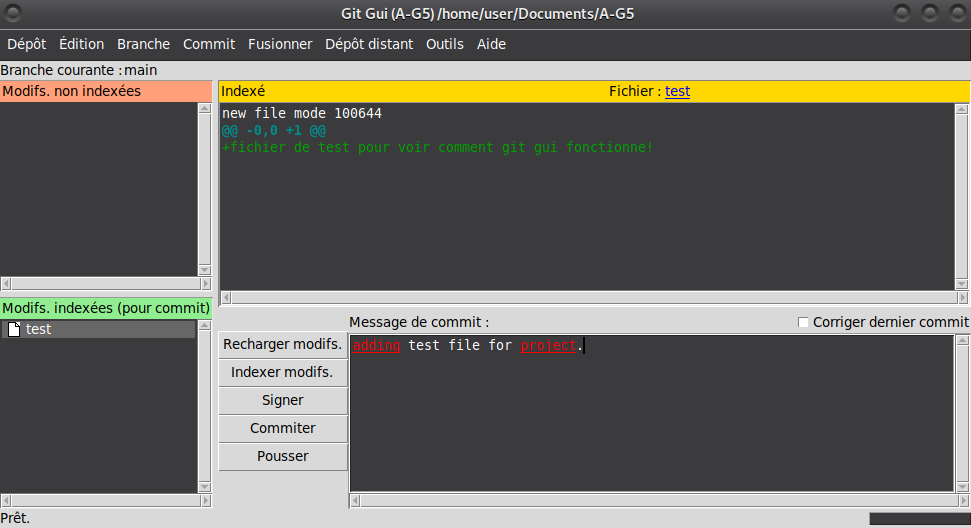
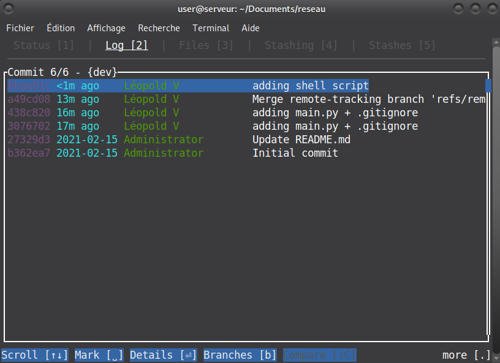

# <u>Rendu 3 : Sélection d'un frontend</u>

## A. Notre avancement dans l'installation

Pour cette étape :

- Nous avons bien paramétré git comme indiqué dans l'énoncé.

  
*Configuration d'une machine pour utilisation de git.*

- Nous avons installé les deux paquets gitk et git-gui.

  
*Gitk et git-gui sont installé sur le serveur.*

- Nous avons choisi GitUI comme interface graphique. [Voir réponses aux questions concernant GitUI.](#uq3-pourquoi-avez-vous-installé-ce-logiciel-u)

  
*Interface principale de GitUI, directement sur le terminal.*

## B. Réponses aux questions

### <u>Q1: Que sont les deux logiciels gitk et git-gui ?</u>

- gitk permet de naviguer sur un dépôt git. L'utilisation de la commande gitk permet de visualiser plusieurs informations :

  - Les changements entre deux commits (ou entre HEAD et un commit)
  - Un graph représentant l'historique des commits et les fusions de branches.
  - Des informations spécifiques sur un commit : date, numéro, commentaires, auteur des modifications (git blame)

  
*Utilisation de gitk sur notre projet de développement S2.01-S2.02 : visualisation de changements récents et graphe des changements.*

- git-gui : c'est une interface graphique de Git (GUI = Graphical User Interface). Celle-ci permet de faire des changements sur le dépôt en créant de nouveaux commits, d'indexer les modifications, de créer de nouvelles branches, de fusionner des branches locales, et permet également de push ou pull les modifications vers/depuis le dépôt.

  
*Utilisation de git-gui sur notre projet de développement : indexation d'un nouveau fichier avant de le push*

- En résumé : gitgui se concentre sur la génération de commit, le push/pull, et la gestion du dépôt, alors que gitk donne des informations sur l'historique de celui-ci.

> Référence :  <https://git-scm.com/docs/gitk/>  
<https://git-scm.com/docs/git-gui>

### <u>Q2: Quelle commande avez-vous utiliser pour installer ces deux applications ?</u>

Nous avons utilisé les commandes :

- `sudo apt install gitk`
- `sudo apt install git-gui`

pour installer respectivement gitk et git-gui.

### <u>Q3: Pourquoi avez vous installé ce logiciel ?</u>

Comme dit [précédemment](#a-notre-avancement-dans-linstallation), nous avons décidé d'installer GitUI sur notre machine pour comparer différentes interfaces git. GitUI à l'avantage d'être gratuit, et d'être libre de droit (licence MIT : utilisation commerciale, utilisation personnelle, modification et distribution autorisés à condition que la notice de licence et de copyright soit incluse dans toutes les copies).  
De plus, cette interface s'utilise à l'aide du terminal en lançant un fichier exécutable, son installation est donc facile et son utilisation nous ne nous est pas étrangère (même s'il y a des aides).

### <u>Q4: Comment l'avez-vous installé ?</u>

L'installation de GitUI est plutôt facile : l'interface se présente sous un fichier `.tar.gz`. Il faut le déplacer dans le répertoire qui contient le dépôt git.  

Pour extraire le fichier contenant le logiciel, il suffit d'utiliser la commande `tar fxz gitui-linux-musl.tar.gz`. Cette commande permet :  

- d'utiliser l'utilitaire tar avec `tar`
- d'utiliser un fichier, de l'extraire et de le désarchiver avec `fxz`  

Nous nous retrouvons avec un fichier exécutable appelé `gitui`.  

Toujours dans le terminal, exécuter le fichier avec `./gitui` suffit à lancer l'interface graphique dans le terminal et commencer à l'utiliser.  

Attention néanmoins, il est conseillé d'ajouter ce fichier `gitgui` dans le fichier `.gitignore` du dépôt git, car c'est un fichier 'personnel' qui n'est sûrement pas utile au développement de l'application du dépôt. A défaut de l'ajouter au fichier, il est recommendé de ne pas l'indexer lors de commit de changements.

Il est également possible d'ajouter GitUI aux variables d'environnement de Linux pour pouvoir l'exécuter partout sans avoir à inclure l'exécutable dans le dépôt git. C'est ce que nous avons fait.

  
*Nous avons déplacé le script GitUI dans le fichier `/usr/bin`, pour que l'utilisation de la commande `gitui` soit disponible partout sur le système : il n'y a plus besoin de d'avoir le fichier gitui dans son dépôt git.*

> Référence : `man tar`  
> nos cours de système du premier semestre

### <u>Q5: Comparez-le à celui inclus avec git (et installé précédemment) : fonctionnalités avantages, inconvénients... ?</u>

Cette interface se rapproche beaucoup plus de git-gui que de gitk, car elle est surtout utile pour indexer des changements, faire des commits, et push/pull le dépôt. Elle ne permet pas de gérer les commits ou d'avoir une visualisation graphique de l'historique des changements.  

L'avantage de cette interface graphique par rapport à git-gui, c'est qu'elle est beaucoup plus pratique à utiliser avec le clavier qu'avec la souris (ce qui est, tout le monde le sait, beaucoup plus rapide). Elle permet également d'avoir plus d'informations sur les commits, même si elle ne remplace pas un graph comme celui disponible avec gitk.

Néanmoins, un inconvéniant à citer est que la résolution de conflits de fusion est assez compliquée, et il n'y a pas d'aides du tout, seulement un prompt qui nous invite à les résoudres.

  
*Commit d'un fichier script shell sur la branche 'dev' avec GitUI.*

  
*Visualisation des commits sur la branche 'dev' : se rapproche de ce que l'on peut trouver avec gitk, mais en plus rudimentaire.*

  
*Fusion de la branche 'dev' dans la branche 'master' : simplifié grâce à GitUI.*
