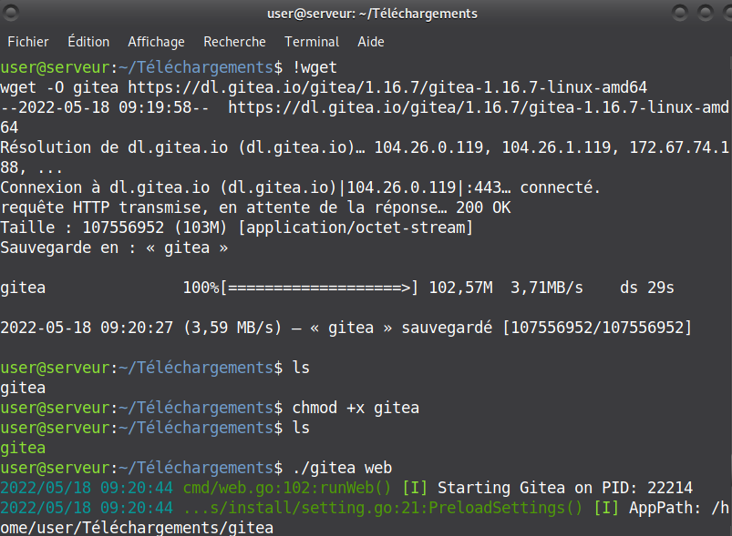
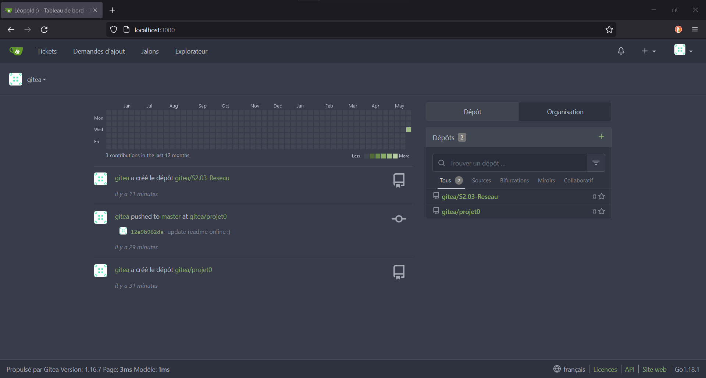

# <u>Rendu 4 : Installation de Gitea</u>

## A. Notre avancement dans l'installation

### <u>Installation de Gitea</u>

Nous avons bien installé Gitea en suivant les instructions de la documentation et avec les contraintes imposées.

  
*Étapes de l'installation de gitea : wget pour obtenir les fichiers binaires, chmod pour le rendre exécutable.*

  
*Configuration initiale de Gitea, en utilisant une base de donnée SQLite.*

  
*Configuration des paramètres administrateur comme demandé : nom d'utilisateur et adresse email.*

Après le suivi de toutes ces étapes, Gitea est installé et utilisable comme n'importe quel autre service Git. Nous avons également installé Gitea en tant que service Linux pour que le service d'hébergement démarre automatique au démarrage du système, indispensable lorsque Gitea est utilisé par de nombreuses personnes.

  
*Configuration en tant que service Linux*

> Références : <https://docs.gitea.io/en-us/install-from-binary/> et <https://docs.gitea.io/en-us/linux-service/>

### <u>Utilistation basique</u>

Nous avons créé un nouveau projet vide pour tester le bon fonctionnement de Gitea.

  
*Création d'une nouveau dépôt avec gitea.*

  
*Modification du fichier README.md en ligne.*

  
*Commit des changements en ligne, le README.md est bien modifié.*

Pour ce qui est du dépôt d'un de nos projet existant, voir [nos réponses à la question 4.](#uq4-que-se-passe-t-il--quelle-semble-en-être-la-cause--lors-dun-dépôt-de-projet-existantu)

### <u>Dépôt de nos rapports</u>

Nous utilisions déjà GitLab pour collaborer sur les fichiers Markdown de nos rapport, nous avons donc décidé de faire un mirroir de notre projet GitLab pour qu'il soit accessible sur les deux services d'hébergement. Voir [nos réponses à la question 4.](#uq4-que-se-passe-t-il--quelle-semble-en-être-la-cause--lors-dun-dépôt-de-projet-existantu)

### <u>Les différents modes d'accès réseau de VirtualBox</u>

Nous avons redirigé les ports de notre machine, et Gitea fonctionnait effectivement depuis notre machine physique, ce qui nous a permis de créer un nouveau projet Gitea à partir d'un de nos projets existant.

  
*Redirection des ports de notre machine.*

  
*Gitea est fonctionnel depuis le navigateur de notre machine physique*

## B. Réponses aux questions

### <u>Q1: Qu'est-ce que Gitea ?</u>

Gitea est une plateforme de service Git auto-hébergée, qui a pour but et principe d'être simple d'installation et d'utilisation. Il s'installe grâce à un fichier binaire utilisable sur toutes les plateformes, et écrit en Go. Il propose les même fonctionnalités que les plus gros services d'hébergement Git.

> Référence : <https://docs.gitea.io/en-us/>

### <u>Q2: A quels logiciels bien connus dans ce domaine peut-on le comparer ? Citez-en au moins 2.</u>

Gitea est comparable à d'autre plateforme d'hébergement de service Git comme GitHub, GitLab et BitBucket, parmis d'autres moins connus comme Gogs et OneDev (qui est un service d'auto hébergement similaire à Gitea), ou encore GitBucket, qui est également un service d'auto hébergement, mais cette fois-ci utilisable grâce à la Java Virtual Machine, garantissant un service multi-plateforme.

### <u>Q3: Qu'est-ce que Markdown ?</u>

Markdown est un langage de balisage léger parmi les plus  populaire.

Il permet d'ajouter des éléments de formattage à un texte simple. Sa lisibilité, sa portabilité et sa versatilité est ce qui rend ce langage très populaire et il est beaucoup utilisé pour réaliser des sites web, des présentations, formatter des emails, réaliser rapidement la documentation d'une application, ou encore de formatter des rendus de projet de réseau. En effet, le Markdown est de base conçu pour être formatté en HTML.

De plus, grâce à sa nature open source, le Markdown a été enrichi par d'autres projets qui l'ont complété, ou bien enrichi ou modifié son formattage pour exécuter des tâches plus précises. Parmi ces variantes, on peut citer  Github Flavored Markdown, qui est l'un des plus populaire grâce à la grande utilisation de Github, ou encore Markdown Extra.

La popularité du Markdown est des langages de balisage légers a également permis la naissance d'autres projets, comme Pandoc, qui permet de convertir rapidement des fichiers textuels en page HTML par exemple.

> Références : <https://en.wikipedia.org/wiki/Markdown>  
<https://daringfireball.net/projects/markdown/>  
<https://www.markdownguide.org/getting-started/>

### <u>Q4: Que se passe-t-il ? Qu'elle semble en être la cause ? (lors d'un dépôt de projet existant)</u>

Pour cette partie, nous avons choisi de tester plusieurs méthodes.  
Tout d'abord, nous allons essayer de push un projet existant depuis notre machine physique vers Gitea.

  
*Tentative de clonage d'un dépôt grâce à `git clone`, mais impossible.*

Il nous est impossible de pull quoi que ce soit sur Gitea depuis la machine hôte. A priori, il est possible que cela soit dû au fait que les deux machines soient dans l'impossibilité de communiquer entre elles, ce qui explique que nous ne pouvons pas ajouter nos projets sur Gitea.  
Il est également possible que même si les deux machines communiquent entre elles, la machine hôte n'a pas accès à Gitea.

Nous avons également décidé d'utiliser la fonctionnalité "migration" inclue avec Gitea. Elle permet de déplacer un dépôt Git hébergé depuis un autre système d'hébergement (Github par exemple) vers Gitea. Il est également possible de faire un miroir de ce dépôt pour qu'il soit accessible à partir des deux plateformes. Nous l'avons fait avec notre dépôt Gitlab que nous utilisons pour collaborer sur les fichiers Markdown qui vous lisez actuellement.

  
*Parce que GitLab est hébergé pour l'Université, et que notre dépôt est privé, nous devons utiliser une token d'accès, pour autoriser gitea à lire le contenu de notre dépôt.*

  
*Utilisation du menu de migration depuis Gitea*

  
*Lorsque des changements sont push sur le dépôt hébergé sur GitLab, les changements apparaissent également sur Gitea*

Alors qu'il nous est (pour l'instant) impossible de créer un nouveau projet à partir d'un de nos projet existant avec la méthode traditionnelle en ligne de commande, la fonctionnalité migration incluse à Gitea fonctionne de base.

<u>Après avoir redirigé les ports (partie 4.4.3) :</u>

Il nous est maintenant possible de créer un projet se basant sur un projet d'une autre ressource qui se trouve sur notre machine physique, car grâce à la rediretion des ports, le service Gitea est accessible depuis la machine hôte.

Pour ce faire, nous avons utilisé projet0, qui était jusqu'ici uniquement composé d'un fichier README.md, pour ajouter les TDs de développement.

  
*Nous indexons les fichiers nouvellement ajoutés.*

Au moment de push nos modifications sur Gitea, malgré des messages d'avertissement et un mécontentement de Git Credential Manager, nous réussissons à publier nos changement en ligne.

  
*Push des nouveaux changements.*

  
*Les changements que nous avons fait sont bien visibles sur Gitea.*

> Références : cours de R2.03.

### <u>Q5: Comparer Gitea avec gitweb et avec le client graphique choisi précédemment.</u>

Gitweb est l'interface web de base pour les dépôts git. Cette interface est fournie avec git nativement, et peut être utilisée en ligne de commande pour visualiser instantanément un dépôt cloné localement à l'aide d'une interface web (avec la commande `git-instaweb`).  
Cette interface offre de nombreuses fonctionnalités prêtes à l'emploi, comme la possibilité de voir tous les commits d'un dépôt, voir les différences entre des commits et/ou des branches, voir les changements par commit, etc...

  
*Page gitweb sur laquelle est hébergé le développement de gitweb.*

Comme on peut le voir sur la capture d'écran ci-dessus, l'interface, bien que complète et fonctionnelle, est assez brut de décoffrage. Comparé à Gitea que nous avons installé plus tôt, il y a beaucoup moins d'éléments graphiques, et aucune aide. Néanmoins, tous les éléments nécessaires à la bonne gestion d'un dépôt git sont présents.  

On peut aussi noter l'absence, comme pour beaucoup d'outils bruts fournis avec git, de fonctionnalités additionnelles qui facilitent l'utilisation, comme une aide au clonage en HTTPS/SSH, la possibilité de modifier des fichiers en ligne, ou encore des outils pour collaborer comme des demandes d'ajout ou des tickets.

En ce qui concerne notre client graphique, il n'est pas réellement comparable avec Gitea. Alors que Gitea est une interface pour l'hébergement de nombreux dépôts git, GitUI nous aide à gérer un dépôt précis, cloné localement depuis Gitea ou tout autre service d'hébergement git.  

Néanmoins, si nous devions comparer les deux, GitUI serait le plus facile et le plus rapide à utiliser, car étant une interface en ligne de commande, il est possible de tout faire au clavier en l'espace de quelques secondes, ce qui fait gagner beaucoup de temps. Les autres fonctionnalités comme la fusion de branche ou l'inspection des commits est également possible sur les deux plateformes, et encore une fois, il s'agit d'une question de préférence entre utiliser la souris ou le clavier. Pour notre part, nous avons choisi GitUI.

> Référence : <https://git-scm.com/docs/gitweb>
